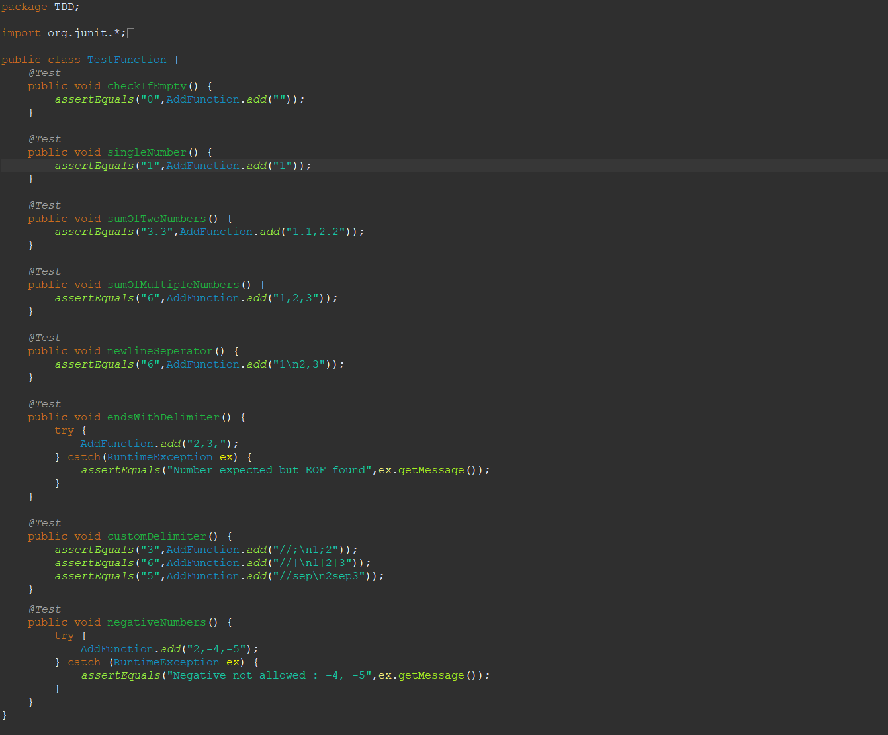
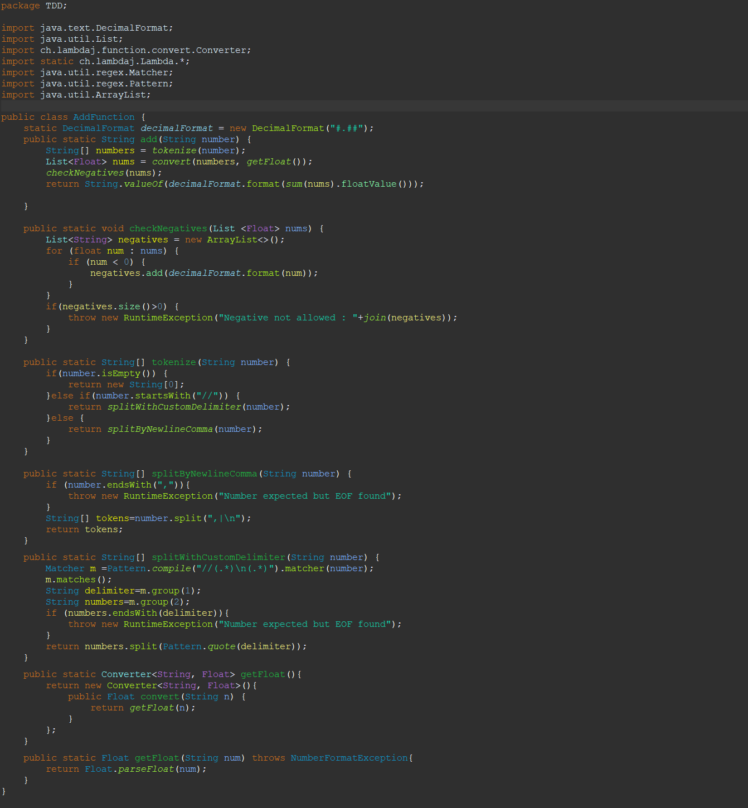

<ul>
<li>Find the java files in src inside TDD package</li>
<li>The AddFunction class contains the add function</li>
<li>The TestFunction contains the unit tests mention in the assignment</li>
</ul>

